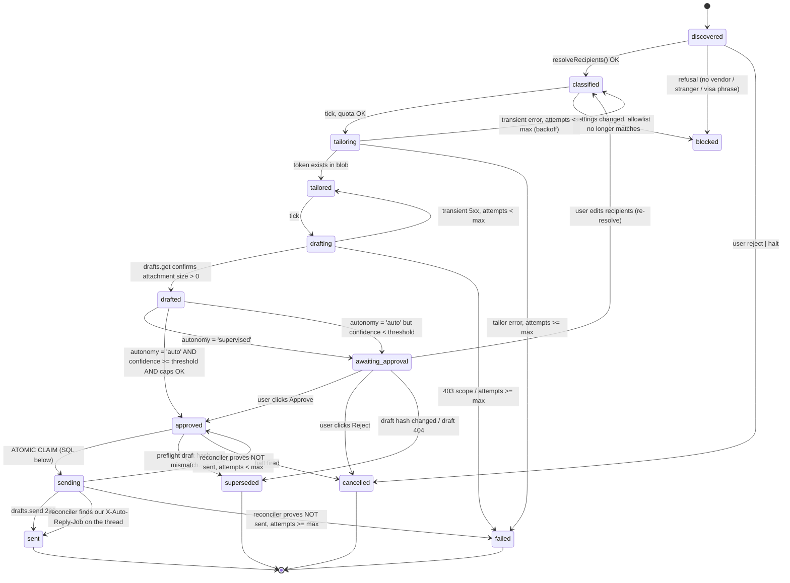

# Auto-Reply Loop — Implementation Design

**Target:** `/dashboard/auto-reply` inside the existing Next.js app (`C:/Users/Eshwa/Downloads/job-dashboard`), deployed on Vercel.
**Purpose:** take the live-verified recruiter-selection logic that currently runs as DOM automation in the Gmail extension (`C:/Users/Eshwa/Daily jobright/gmail-jd-reply-board/content.js`) and re-host it as a server-side loop driven by the Gmail REST API, with a supervised→auto autonomy setting and a learning store.

Every claim below cites the file and line it is grounded in. Anything not present in the codebase today is marked **NEW**.

---

## 0. Scope note: what this replaces and what it does not

The extension path (`content.js`) is a *DOM* automation: it clicks Gmail's Reply control (`content.js:700-703`), rebuilds recipient chips (`content.js:602-632`), and attaches via a real `input[type=file]` (`content.js:237-256`). None of that transfers. What transfers is the **decision logic** — middleman detection, vendor extraction, the allowlist verification, and the fail-closed discipline — which is re-implemented against the Gmail REST API.

The extension remains the fallback for anything the API path refuses.

---

## 1. What exists vs what is NEW

| Concern | Status | Where / what |
|---|---|---|
| Gmail REST access from a route handler | **EXISTS** | `src/app/api/gmail-sync/route.ts:16` (`GMAIL_API` base), `:62-68` (`gmailGet` helper) |
| Google access-token refresh | **EXISTS** | `src/app/api/gmail-sync/route.ts:43-60` (`refreshAccessToken`, uses `GOOGLE_CLIENT_ID`/`GOOGLE_CLIENT_SECRET`) |
| Refresh token persisted server-side | **EXISTS** | `src/app/auth/callback/gmail/route.ts:57-65` writes `profiles.gmail_refresh_token` + `gmail_connected_at` |
| Token resolution order (session → profiles) | **EXISTS** | `src/app/api/gmail-sync/route.ts:286-298` |
| OAuth scope | **EXISTS, MUST CHANGE** | `src/lib/google-auth.ts:41-42` — `GMAIL_SCOPES` is `email profile https://www.googleapis.com/auth/gmail.readonly`. **NEW:** add `gmail.compose`. |
| `access_type=offline` + `prompt=consent` | **EXISTS** | `src/lib/google-auth.ts:55` — already forces a refresh token, so the scope upgrade re-consent will also return one |
| OAuth callback with `?return=` round-trip | **EXISTS** | `src/app/auth/callback/gmail/route.ts:19-25`, `:72` |
| Supabase server client (anon key, cookie session) | **EXISTS** | `src/lib/supabase/server.ts:30-53` |
| Supabase client from `Authorization: Bearer` | **EXISTS** | `src/lib/supabase/server.ts:60-71` |
| Supabase **service-role** client | **NEW** | Nothing exists. `SUPABASE_SERVICE_ROLE_KEY` appears only as an admin-config *label* at `src/lib/adminConfig.ts:55`. A cron using the anon key hits RLS (`supabase/schema.sql:50-71`) and reads/writes nothing. **NEW file: `src/lib/supabase/service.ts`.** |
| Tailoring engine | **EXISTS** | `src/app/api/tailor/route.ts:72-80` calls `runTailor` from `src/lib/tailor.ts:90`; result carries `token` (`src/lib/tailor.ts:10-11`, `:383-384`, `:448`) |
| Tailored `.docx` retrieval by token | **EXISTS** | `src/app/api/tailor/file/route.ts:46-49` → `blob.get('tailored/<token>.docx')`; 404s with "Tailored file expired" |
| Durable blob storage | **EXISTS, MUST BE CONFIGURED** | `src/lib/storage.ts:258-265` — R2 only when all four of `R2_BUCKET`/`R2_ACCOUNT_ID`/`R2_ACCESS_KEY_ID`/`R2_SECRET_ACCESS_KEY` are set; otherwise `FsStorage(DATA_DIR)` and `DATA_DIR` is `/tmp/mf` on Vercel (`src/lib/paths.ts:19-24`). Without R2 the tailored `.docx` is gone by the next request. |
| Unauthenticated tailor → `userId = "demo"` | **EXISTS (hazard)** | `src/app/api/tailor/route.ts:21-27` — `resolveUserId()` returns `"demo"` on no session. A cron-invoked tailor MUST pass an explicit `filepath` (`src/app/api/tailor/route.ts:74`, `givenPath`) and never rely on auto-matching inside the demo user's resume dir. |
| Rate limiting | **EXISTS, UNUSABLE FOR CAPS** | `src/lib/rateLimit.ts:7` is an in-memory `Map`, documented as resetting on restart/redeploy (`:1-5`). Send caps must be SQL `COUNT`. |
| Vercel function duration | **EXISTS (constraint)** | `vercel.json:4-8` sets `maxDuration: 30` for `src/app/api/**`. Note this *conflicts* with `export const maxDuration = 60` in `src/app/api/tailor/route.ts:12` — the `vercel.json` block wins for the glob. Budget the tick at ≤25s. |
| `no-store` on all API responses | **EXISTS** | `vercel.json:16-21` |
| Supabase schema + RLS pattern | **EXISTS** | `supabase/schema.sql:11-48` (tables), `:50-71` (per-user RLS) |
| Middleman domain detection | **EXISTS (in extension)** | `content.js:516-521` — `MIDDLEMAN_TERMS = ["cloudquestit","tekblu"]`, matched on a whole **domain label**, so `cloudquestit@gmail.com` and `cloudquestit.attacker.com` cannot pass |
| Sender allowlist | **EXISTS (in extension)** | `content.js:873-888` — `DEFAULT_SENDER_ALLOWLIST`, `senderAllowed()` |
| Vendor extraction rule | **EXISTS (in extension)** | `content.js:680-689` — vendor = original **To** − self − middleman − freemail; explicit "NO Cc→To FALLBACK" (`content.js:682-687`) |
| Allowlist verification of final recipients | **EXISTS (in extension)** | `content.js:735-745` (compose path), `content.js:1131-1153` (existing-draft path) |
| Visa-language refusal | **EXISTS (in extension)** | `jd_parse.js:168-171` `visaLanguageViolation`, enforced at `content.js:661-662` and `content.js:1161-1162` |
| `/dashboard/auto-reply` page | **NEW** | 36 dashboard pages exist (`src/app/dashboard/*/page.tsx`); this is not one of them |
| `/api/auto-reply/**` routes | **NEW** | 31 API routes exist; none under `auto-reply` |
| Cron trigger of any kind | **NEW** | No `crons` key in `vercel.json`; no `CRON_SECRET` anywhere in `src/`; no auto-reply workflow in `.github/workflows/` (existing: `ci.yml`, `deploy.yml`, `nextjs-ci.yml`, `nextjs-deploy.yml`, `careerkit-ci.yml`, `careerkit-deploy.yml`) |
| `SendAdapter` abstraction | **NEW** | `src/lib/auto-reply/send-adapter.ts` |
| MIME wrap/attach helpers | **NEW** | `src/lib/auto-reply/mime.ts` |
| All six `auto_reply_*` tables | **NEW** | `supabase/auto-reply-schema.sql` |

---

## 2. State machine for one draft

### 2.1 States

Each row in `auto_reply_jobs` is exactly one thread's reply attempt.

| State | Meaning | Terminal? |
|---|---|---|
| `discovered` | Thread matched the discovery query. Nothing read beyond metadata. | no |
| `classified` | JD body scraped, middleman confirmed, recipients resolved and frozen onto the row. | no |
| `blocked` | Recipient resolution refused (no vendor, stranger addressee, freemail-only To, visa-language body). Needs a human. | **semi-terminal** — only `POST /jobs/[id]/recipients` or `/reject` moves it |
| `tailoring` | `runTailor` in flight. | no |
| `tailored` | `resume_token` set and the object exists in blob storage. | no |
| `drafting` | Building RFC822 and calling `drafts.create`/`drafts.update`. | no |
| `drafted` | Gmail draft exists, attachment byte-count verified via `drafts.get`. | no |
| `awaiting_approval` | Supervised mode: held for a human click. | no |
| `approved` | Cleared to send. In `auto` mode the tick sets this directly from `drafted`. | no |
| `sending` | **Claimed.** Exactly one worker owns this row. | no |
| `sent` | Gmail returned a message id and it was reconciled onto the thread. | **TERMINAL** |
| `failed` | Retry budget exhausted or a non-retryable error. | **TERMINAL** |
| `cancelled` | User rejected, or the global halt caught it before send. | **TERMINAL** |
| `superseded` | The Gmail draft was edited or deleted outside the loop; our prepared bytes no longer describe reality. | **TERMINAL** |

Terminal set: `{sent, failed, cancelled, superseded}`. No transition leaves them. A user who wants another attempt creates a **new row** (new `attempt_seq`, new idempotency key) — never a resurrection, because resurrection is how a duplicate send happens.

### 2.2 Transitions



Only two transitions ever call Gmail's send endpoint: `approved → sending` (which acquires the claim) and nothing else. `sending → sent` records the outcome; it never re-issues the call.

### 2.3 Idempotency: why "never send twice" is provable

Three mechanisms stack. Any one alone has a hole; together they close.

**(a) The identity is content-derived, not row-derived.**

```
send_idempotency_key = sha256(
  user_id || '\x1e' ||
  gmail_thread_id || '\x1e' ||
  gmail_draft_id || '\x1e' ||
  sha256(final_body_utf8) || '\x1e' ||
  resume_token || '\x1e' ||
  to_addrs_sorted_joined || '\x1e' ||
  cc_addrs_sorted_joined
)
```

computed at `drafting → drafted` and stored on the row. It is the same value no matter which instance computes it, so two overlapping ticks that both prepared the same reply collide.

**(b) The ledger row is inserted BEFORE the network call.**

`auto_reply_sends` has `UNIQUE (send_idempotency_key)`. The worker does:

1. `INSERT INTO auto_reply_sends (..., status='in_flight', rfc822_msgid, sent_at=NULL)`.
   - Unique violation (`23505`) ⇒ someone already owns this exact send. Do **not** call Gmail. Read the existing row: if `status='sent'`, mark the job `sent` and move on; if `in_flight`, leave the job in `sending` for the reconciler.
2. Call `drafts.send`.
3. `UPDATE auto_reply_sends SET status='sent', gmail_message_id=$, sent_at=now() WHERE id=$`.

The insert is the commit point. A crash between (1) and (3) leaves an `in_flight` row that the reconciler resolves against Gmail — it never becomes a second send.

**(c) The message carries a fingerprint Gmail will echo back.**

The RFC822 we PUT includes a custom header:

```
X-Auto-Reply-Job: <job_id>.<attempt_seq>
Message-ID: <ar-<job_id>-<attempt_seq>@<AUTO_REPLY_MSGID_DOMAIN>>
```

Custom `X-` headers survive `drafts.send`. Reconciliation for any row stuck in `sending` is therefore a *question to Gmail*, not a guess:

```
GET /users/me/threads/{threadId}?format=metadata&metadataHeaders=X-Auto-Reply-Job&metadataHeaders=Message-ID
```

If any message on the thread carries our `X-Auto-Reply-Job` value → it sent; mark `sent`. If none does *and* `drafts.get(draftId)` still returns the draft → it did not send; release back to `approved`. If neither is true (no header, no draft) → **do not retry**; mark `failed` with `needs_human=true`. Ambiguity resolves toward not sending, because an unsent reply costs one manual click and a doubled reply costs credibility with a recruiter.

**Unique indexes that enforce it:**

```sql
-- the ledger: one send per content identity, ever
alter table public.auto_reply_sends
  add constraint auto_reply_sends_idem_uniq unique (send_idempotency_key);

-- at most ONE non-terminal job per thread per user (stops overlapping ticks
-- from creating two parallel jobs for the same thread)
create unique index auto_reply_jobs_one_live_per_thread
  on public.auto_reply_jobs (user_id, gmail_thread_id)
  where status not in ('sent','failed','cancelled','superseded');

-- at most ONE successful send per thread per user, ever
create unique index auto_reply_sends_one_sent_per_thread
  on public.auto_reply_sends (user_id, gmail_thread_id)
  where status = 'sent';
```

The last index is the backstop: even if every other guard is defeated, a second successful send to the same thread cannot be recorded, and since the ledger row is written *before* the network call, it cannot be attempted either.

### 2.4 The atomic send-claim UPDATE (exact SQL)

Executed with the **service-role** client from `POST /api/auto-reply/tick`:

```sql
UPDATE public.auto_reply_jobs AS j
SET
  status        = 'sending',
  claimed_by    = $2,                       -- run_id (uuid) of this tick
  claimed_at    = now(),
  send_attempts = j.send_attempts + 1,
  updated_at    = now()
WHERE j.id = $1
  AND j.user_id = $3
  AND j.status = 'approved'
  AND j.send_attempts < j.max_send_attempts
  AND NOT EXISTS (
        SELECT 1 FROM public.auto_reply_sends s
        WHERE s.send_idempotency_key = j.send_idempotency_key
      )
  AND NOT EXISTS (
        SELECT 1 FROM public.auto_reply_sends s
        WHERE s.user_id = j.user_id
          AND s.gmail_thread_id = j.gmail_thread_id
          AND s.status = 'sent'
      )
  AND (
        SELECT count(*) FROM public.auto_reply_sends s
        WHERE s.user_id = j.user_id
          AND s.status IN ('sent','in_flight')
          AND s.created_at >= date_trunc('day', now() AT TIME ZONE $4)
      ) < (
        SELECT daily_send_cap FROM public.auto_reply_settings
        WHERE user_id = j.user_id
      )
  AND (
        SELECT count(*) FROM public.auto_reply_sends s
        WHERE s.user_id = j.user_id
          AND s.status IN ('sent','in_flight')
          AND s.created_at >= now() - interval '1 hour'
      ) < (
        SELECT hourly_send_cap FROM public.auto_reply_settings
        WHERE user_id = j.user_id
      )
  AND (
        SELECT NOT halted FROM public.auto_reply_settings WHERE user_id = j.user_id
      )
RETURNING j.id, j.gmail_thread_id, j.gmail_draft_id,
          j.send_idempotency_key, j.to_addrs, j.cc_addrs, j.attempt_seq;
```

**Why this is safe across overlapping ticks:** the `UPDATE` takes a row-level write lock. Two concurrent ticks targeting the same row serialize; the second re-evaluates `status = 'approved'` against the *committed* value (`'sending'`) and matches zero rows. `RETURNING` yields no row → that worker does nothing. There is no read-then-write window.

**Why the caps live inside this statement:** `src/lib/rateLimit.ts:7` is a per-instance `Map`. Two Vercel lambdas each believe they are under the cap. The `count(*)` subqueries are evaluated inside the same locked statement against shared state, so the cap is global and survives redeploys.

**Stale-claim recovery** is deliberately *not* a time-based auto-release in this UPDATE (a 10-minute timeout would let a slow-but-succeeding send be re-sent). Instead a separate reconcile phase (§8, "mid-send crash") asks Gmail and then explicitly moves the row.

---

## 3. Schema — `supabase/auto-reply-schema.sql` (**NEW**, run once in the SQL Editor)

Follows the existing conventions in `supabase/schema.sql:11-48`: `uuid primary key default gen_random_uuid()`, `user_id uuid references auth.users(id) on delete cascade`, `timestamptz not null default now()`.

```sql
-- ════════════════════════════════════════════════════════════════
-- Auto-Reply Loop — additive schema. Safe to re-run.
-- RLS model: the browser (anon key) gets SELECT on its own rows and
-- NOTHING else. Every insert/update/delete goes through an API route
-- holding SUPABASE_SERVICE_ROLE_KEY, which bypasses RLS entirely.
-- ════════════════════════════════════════════════════════════════

-- ── 1) SETTINGS — one row per user ──────────────────────────────
create table if not exists public.auto_reply_settings (
  user_id              uuid primary key references auth.users(id) on delete cascade,

  enabled              boolean     not null default false,
  autonomy             text        not null default 'supervised'
                                   check (autonomy in ('supervised','auto')),
  halted               boolean     not null default false,
  halt_reason          text,
  halted_at            timestamptz,

  -- discovery
  sender_allowlist     text[]      not null default array['tekblu','cloudquestit'],
  discovery_query      text        not null default 'in:inbox newer_than:7d -in:chats',
  lookback_days        int         not null default 7 check (lookback_days between 1 and 30),
  max_discover_per_tick int        not null default 25 check (max_discover_per_tick between 1 and 100),

  -- caps (SQL-counted, never rateLimit.ts)
  daily_send_cap       int         not null default 12  check (daily_send_cap  between 0 and 60),
  hourly_send_cap      int         not null default 4   check (hourly_send_cap between 0 and 20),
  timezone             text        not null default 'America/New_York',
  quiet_hours_start    int         not null default 21  check (quiet_hours_start between 0 and 23),
  quiet_hours_end      int         not null default 7   check (quiet_hours_end   between 0 and 23),
  send_on_weekends     boolean     not null default false,

  -- autonomy gating
  auto_min_confidence  numeric(3,2) not null default 0.85
                                    check (auto_min_confidence between 0 and 1),
  auto_requires_prior_success boolean not null default true,

  -- resume / tailoring
  base_resume_filepath text,                       -- explicit path; NEVER auto-match (see §7)
  attach_resume        boolean     not null default true,
  attach_over_existing boolean     not null default false,

  -- send transport
  send_adapter         text        not null default 'gmail_api'
                                   check (send_adapter in ('gmail_api','smtp_app_password')),

  created_at           timestamptz not null default now(),
  updated_at           timestamptz not null default now()
);

-- ── 2) JOB / QUEUE — one row per thread reply attempt ───────────
create table if not exists public.auto_reply_jobs (
  id                   uuid primary key default gen_random_uuid(),
  user_id              uuid not null references auth.users(id) on delete cascade,

  -- Gmail identity
  gmail_thread_id      text not null,
  gmail_message_id     text,                       -- the recruiter message we are replying to
  gmail_draft_id       text,
  draft_content_hash   text,                       -- sha256 of drafts.get RAW at last inspection
  rfc822_msgid         text,                       -- the Message-ID we minted
  attempt_seq          int  not null default 1,

  -- thread facts (frozen at classification; never re-derived at send time)
  middleman_addr       text,                       -- the address the mail came FROM
  middleman_domain     text,
  thread_from          text[] not null default '{}',
  thread_to            text[] not null default '{}',
  thread_cc            text[] not null default '{}',
  subject              text,
  references_header    text,
  in_reply_to_header   text,

  -- resolved recipients (the ONLY addresses that may ever be used)
  to_addrs             text[] not null default '{}',
  cc_addrs             text[] not null default '{}',
  recipient_source     text check (recipient_source in
                         ('rule','rule+learned','user_corrected')),
  recipient_confidence numeric(3,2) not null default 0,
  block_reason         text,

  -- JD + generated content
  jd_text              text,
  role_title           text,
  company              text,
  body_text            text,
  body_hash            text,
  resume_token         text,                       -- src/lib/tailor.ts:383 → blob 'tailored/<token>.docx'
  resume_filename      text,

  -- lifecycle
  status               text not null default 'discovered' check (status in (
                         'discovered','classified','blocked','tailoring','tailored',
                         'drafting','drafted','awaiting_approval','approved',
                         'sending','sent','failed','cancelled','superseded')),
  send_idempotency_key text,
  send_attempts        int  not null default 0,
  max_send_attempts    int  not null default 2,
  prep_attempts        int  not null default 0,
  max_prep_attempts    int  not null default 3,
  next_attempt_at      timestamptz not null default now(),
  claimed_by           uuid,                       -- run_id
  claimed_at           timestamptz,
  needs_human          boolean not null default false,
  last_error           text,

  approved_by_user_at  timestamptz,
  sent_at              timestamptz,
  created_at           timestamptz not null default now(),
  updated_at           timestamptz not null default now()
);

create index if not exists auto_reply_jobs_user_status_idx
  on public.auto_reply_jobs (user_id, status, next_attempt_at);
create index if not exists auto_reply_jobs_thread_idx
  on public.auto_reply_jobs (user_id, gmail_thread_id, created_at desc);

-- IDEMPOTENCY: at most one live job per thread
create unique index if not exists auto_reply_jobs_one_live_per_thread
  on public.auto_reply_jobs (user_id, gmail_thread_id)
  where status not in ('sent','failed','cancelled','superseded');

-- IDEMPOTENCY: the content identity is unique across all history
create unique index if not exists auto_reply_jobs_idem_uniq
  on public.auto_reply_jobs (send_idempotency_key)
  where send_idempotency_key is not null;

-- ── 3) SEND LEDGER — the row that makes "never twice" provable ──
create table if not exists public.auto_reply_sends (
  id                   uuid primary key default gen_random_uuid(),
  user_id              uuid not null references auth.users(id) on delete cascade,
  job_id               uuid not null references public.auto_reply_jobs(id) on delete cascade,

  send_idempotency_key text not null,
  gmail_thread_id      text not null,
  gmail_draft_id       text,
  gmail_message_id     text,                       -- returned by drafts.send
  rfc822_msgid         text not null,
  to_addrs             text[] not null,
  cc_addrs             text[] not null default '{}',
  adapter              text not null default 'gmail_api',

  status               text not null default 'in_flight'
                       check (status in ('in_flight','sent','abandoned')),
  error                text,
  created_at           timestamptz not null default now(),  -- the cap clock
  sent_at              timestamptz
);

alter table public.auto_reply_sends
  drop constraint if exists auto_reply_sends_idem_uniq;
alter table public.auto_reply_sends
  add  constraint auto_reply_sends_idem_uniq unique (send_idempotency_key);

create unique index if not exists auto_reply_sends_one_sent_per_thread
  on public.auto_reply_sends (user_id, gmail_thread_id)
  where status = 'sent';

-- the exact index the cap subqueries in §2.4 scan
create index if not exists auto_reply_sends_user_created_idx
  on public.auto_reply_sends (user_id, status, created_at desc);

-- ── 4) EVENT LOG — append-only; the audit trail ─────────────────
create table if not exists public.auto_reply_events (
  id           bigserial primary key,
  user_id      uuid not null references auth.users(id) on delete cascade,
  job_id       uuid references public.auto_reply_jobs(id) on delete cascade,
  run_id       uuid,
  at           timestamptz not null default now(),
  kind         text not null,        -- 'discovered','classified','blocked','tailored',
                                     -- 'drafted','approved','claimed','sent','refused',
                                     -- 'reconciled','halted','user_corrected','settings_changed'
  from_status  text,
  to_status    text,
  actor        text not null default 'system'
               check (actor in ('system','user','cron','reconciler')),
  detail       jsonb not null default '{}'::jsonb,
  redacted     boolean not null default false
);
create index if not exists auto_reply_events_job_idx  on public.auto_reply_events (job_id, at desc);
create index if not exists auto_reply_events_user_idx on public.auto_reply_events (user_id, at desc);

-- Append-only, enforced at the DB level (service role included).
create or replace function public.auto_reply_events_no_mutate()
returns trigger language plpgsql as $$
begin
  raise exception 'auto_reply_events is append-only';
end $$;
drop trigger if exists auto_reply_events_immutable on public.auto_reply_events;
create trigger auto_reply_events_immutable
  before update or delete on public.auto_reply_events
  for each row execute function public.auto_reply_events_no_mutate();

-- ── 5) RUN LOG — one row per cron tick ──────────────────────────
create table if not exists public.auto_reply_runs (
  id                uuid primary key default gen_random_uuid(),
  user_id           uuid references auth.users(id) on delete cascade,
  trigger           text not null default 'cron'
                    check (trigger in ('cron','manual','backfill')),
  phase             text not null default 'all'
                    check (phase in ('discover','prepare','send','reconcile','all')),
  started_at        timestamptz not null default now(),
  finished_at       timestamptz,
  duration_ms       int,
  discovered_count  int not null default 0,
  classified_count  int not null default 0,
  blocked_count     int not null default 0,
  tailored_count    int not null default 0,
  drafted_count     int not null default 0,
  sent_count        int not null default 0,
  refused_count     int not null default 0,
  reconciled_count  int not null default 0,
  error_count       int not null default 0,
  outcome           text not null default 'running'
                    check (outcome in ('running','ok','partial','error','halted','skipped_quiet_hours')),
  error             text,
  github_run_id     text
);
create index if not exists auto_reply_runs_user_time_idx
  on public.auto_reply_runs (user_id, started_at desc);

-- ── 6) RECRUITER LEARNING STORE ─────────────────────────────────
-- One row per (user, middleman domain, address). Counters are updated ONLY
-- from observed outcomes and explicit user corrections. This store may
-- NARROW a rule-derived candidate set; it may never WIDEN it (see §6).
create table if not exists public.auto_reply_recipients (
  id                uuid primary key default gen_random_uuid(),
  user_id           uuid not null references auth.users(id) on delete cascade,

  address           text not null,                       -- lowercased
  address_domain    text not null,                       -- lowercased
  middleman_domain  text not null default '',            -- context; '' = any

  verdict           text not null default 'neutral'
                    check (verdict in ('vouched','neutral','blocked','manual_only')),
  is_freemail       boolean not null default false,
  is_middleman      boolean not null default false,

  times_seen_in_to  int not null default 0,
  times_seen_in_cc  int not null default 0,
  times_chosen      int not null default 0,   -- we put it in To and the send went out
  times_user_added  int not null default 0,   -- user added it in the UI
  times_user_removed int not null default 0,  -- user removed it in the UI
  times_bounced     int not null default 0,
  times_replied     int not null default 0,   -- a human reply came back from this address

  display_name      text,
  first_seen_at     timestamptz not null default now(),
  last_seen_at      timestamptz not null default now(),
  last_corrected_at timestamptz,
  note              text
);

create unique index if not exists auto_reply_recipients_uniq
  on public.auto_reply_recipients (user_id, address, middleman_domain);
create index if not exists auto_reply_recipients_lookup_idx
  on public.auto_reply_recipients (user_id, middleman_domain, verdict);

-- ── RLS: browser reads its own rows; the browser NEVER writes ───
alter table public.auto_reply_settings   enable row level security;
alter table public.auto_reply_jobs       enable row level security;
alter table public.auto_reply_sends      enable row level security;
alter table public.auto_reply_events     enable row level security;
alter table public.auto_reply_runs       enable row level security;
alter table public.auto_reply_recipients enable row level security;

create policy "ar settings read"   on public.auto_reply_settings   for select using (auth.uid() = user_id);
create policy "ar jobs read"       on public.auto_reply_jobs       for select using (auth.uid() = user_id);
create policy "ar sends read"      on public.auto_reply_sends      for select using (auth.uid() = user_id);
create policy "ar events read"     on public.auto_reply_events     for select using (auth.uid() = user_id);
create policy "ar runs read"       on public.auto_reply_runs       for select using (auth.uid() = user_id);
create policy "ar recipients read" on public.auto_reply_recipients for select using (auth.uid() = user_id);

-- NO insert/update/delete policies exist for any of these tables. With RLS on
-- and no permissive policy, the anon/authenticated role cannot mutate them at
-- all. Only SUPABASE_SERVICE_ROLE_KEY (which bypasses RLS) can — i.e. only the
-- API routes. This is deliberate: a browser must never be able to flip a job to
-- 'approved' or edit to_addrs directly.
```

**`src/lib/supabase/service.ts` (NEW)** — mirrors the defensive shape of `src/lib/supabase/server.ts:30-33` (return a stub rather than throw when unconfigured):

```ts
import { createClient as createSupabaseClient } from "@supabase/supabase-js"

/** Service-role client. Bypasses RLS. NEVER import this from a Client Component. */
export function createServiceClient() {
  const url = process.env.NEXT_PUBLIC_SUPABASE_URL
  const key = process.env.SUPABASE_SERVICE_ROLE_KEY   // labelled at src/lib/adminConfig.ts:55
  if (!url || !key) throw new Error("auto-reply: SUPABASE_SERVICE_ROLE_KEY not configured")
  return createSupabaseClient(url, key, { auth: { persistSession: false, autoRefreshToken: false } })
}
```

Unlike `createClient()` in `src/lib/supabase/server.ts`, this **throws** instead of stubbing. A stub that silently resolves to `{ data: null }` (`src/lib/supabase/server.ts:19`) would make the cron report "0 jobs, all good" forever while doing nothing — the worst possible failure for an unattended loop.

---

## 4. API routes (all **NEW**, under `src/app/api/auto-reply/`)

Two auth modes:

- **`session`** — `createClient()` from `src/lib/supabase/server.ts:30`, then `auth.getUser()`. 401 when absent. Note this is the *opposite* of `src/app/api/tailor/route.ts:21-27`, which falls back to `"demo"`; no auto-reply route may ever do that.
- **`cron`** — `Authorization: Bearer <AUTO_REPLY_CRON_SECRET>`, compared with a constant-time equality (`crypto.timingSafeEqual`). 401 on mismatch. Cron routes carry `export const dynamic = "force-dynamic"`. `vercel.json:16-21` already sets `Cache-Control: no-store` for `/api/(.*)`.

| # | Path | Method | Auth | Request | Response |
|---|---|---|---|---|---|
| 1 | `/api/auto-reply/settings` | GET | session | — | `{ ok, settings: {...}, gmail: { connected, scopes, hasCompose }, storage: { r2Configured }, caps: { sentToday, sentThisHour, dailyCap, hourlyCap } }` |
| 2 | `/api/auto-reply/settings` | PUT | session | `{ enabled?, autonomy?, sender_allowlist?, daily_send_cap?, hourly_send_cap?, quiet_hours_start?, quiet_hours_end?, send_on_weekends?, auto_min_confidence?, base_resume_filepath?, attach_resume?, attach_over_existing?, send_adapter? }` | `{ ok, settings }` — writes an `auto_reply_events` row `kind='settings_changed'` with a before/after diff |
| 3 | `/api/auto-reply/jobs` | GET | session | query `?status=&limit=50&cursor=` | `{ ok, jobs: [{ id, status, subject, company, role_title, middleman_addr, to_addrs, cc_addrs, recipient_source, recipient_confidence, block_reason, resume_filename, needs_human, last_error, updated_at }], nextCursor }` |
| 4 | `/api/auto-reply/jobs/[id]` | GET | session | — | job row + `{ events: [...], body_text, jd_text, draftUrl }` where `draftUrl = https://mail.google.com/mail/u/0/#drafts?compose=<gmail_draft_id>` |
| 5 | `/api/auto-reply/jobs/[id]/approve` | POST | session | `{ expected_body_hash, expected_to: string[], expected_cc: string[] }` | `{ ok, status }` — **refuses with 409** if any expected value differs from the row. The user approves the bytes they were shown, not the row id. |
| 6 | `/api/auto-reply/jobs/[id]/reject` | POST | session | `{ reason? }` | `{ ok, status: "cancelled" }` |
| 7 | `/api/auto-reply/jobs/[id]/recipients` | POST | session | `{ to: string[], cc: string[], reason? }` | `{ ok, status: "classified", learned: { vouched: [], blocked: [], manual_only: [] } }` — the correction feeds `auto_reply_recipients` (§6.4) and forces `recipient_source='user_corrected'`. Cc is validated against the middleman rule and rejected with 422 otherwise. |
| 8 | `/api/auto-reply/jobs/[id]/retailor` | POST | session | `{ filepath?, noCache? }` | `{ ok, status: "tailoring" }` — resets to `classified` and clears `resume_token` |
| 9 | `/api/auto-reply/halt` | POST | session | `{ halted: boolean, reason? }` | `{ ok, halted, cancelled_count }` — setting `halted=true` also moves every `approved` and `awaiting_approval` job to `cancelled` |
| 10 | `/api/auto-reply/runs` | GET | session | `?limit=30` | `{ ok, runs: [...] }` |
| 11 | `/api/auto-reply/tick` | POST | **cron** | `{ user_id?, phase?: "discover"\|"prepare"\|"send"\|"reconcile"\|"all", max_jobs?: number, dry_run?: boolean, github_run_id?: string }` | `{ ok, run_id, phase, counts: { discovered, classified, blocked, tailored, drafted, sent, refused, reconciled, errors }, outcome, halted?, next_phase_hint }` |
| 12 | `/api/auto-reply/tick` | GET | **cron** | — | `{ ok: true, ready: boolean, blockers: string[] }` — health probe the workflow calls first; `blockers` lists e.g. `"no gmail.compose scope"`, `"R2 not configured"`, `"halted"` |

`POST /api/auto-reply/tick` runs **one phase per invocation** and budgets ≤25s, because `vercel.json:4-8` caps `src/app/api/**` at `maxDuration: 30`. The workflow (§9) calls the phases in sequence as separate HTTP requests. `phase: "all"` exists for local/manual use only and is refused when `process.env.VERCEL` is set.

---

## 5. The UI page — `src/app/dashboard/auto-reply/page.tsx` (**NEW**)

A client component polling `/api/auto-reply/jobs` and `/api/auto-reply/settings` every 20s. All mutations go through the API routes; the browser holds only the anon key and RLS gives it `select` only (§3).

### Section A — Status bar (sticky top)

Shows: autonomy pill (`Supervised` / `Auto`), `sent today N / cap`, `sent this hour N / cap`, last run time + outcome, and a red **HALT** button.

Actions:
- **Toggle Supervised ↔ Auto** → `PUT /settings` (`autonomy`). Switching to `auto` opens a confirm dialog listing the current caps and the count of jobs sitting in `awaiting_approval`.
- **HALT** → `POST /halt {halted:true}`. Turns the bar red, cancels every pending/approved job, and every subsequent tick returns `outcome:"halted"` without touching Gmail.
- **Resume** (only when halted) → `POST /halt {halted:false}`, requires typing `RESUME` to confirm.

### Section B — Preflight / readiness

Rendered from `GET /api/auto-reply/tick` (health probe, proxied through the session route) plus `GET /settings`. One row per check, green/red:

- Gmail connected + **`gmail.compose` granted** — red until the scope upgrade; button **Re-connect Gmail** calls `connectGmail("/dashboard/auto-reply")` (`src/lib/google-auth.ts:46-58`) with the widened `GMAIL_SCOPES`.
- Refresh token present (`profiles.gmail_refresh_token`, written at `src/app/auth/callback/gmail/route.ts:59-62`).
- **R2 configured** — red if any of the four `R2_*` vars is missing (`src/lib/storage.ts:259-262`); explains that tailored `.docx` files vanish between requests without it (`src/lib/paths.ts:19-24`).
- Service-role key configured.
- Cron secret configured, and "last cron heartbeat" age.
- Base resume filepath set — red if empty, with the explanation that an unset path would let `/api/tailor` resolve to `"demo"` (`src/app/api/tailor/route.ts:21-27`).

### Section C — Settings form

Fields: autonomy, `enabled`, sender allowlist (chips, default `tekblu`, `cloudquestit` — mirrors `content.js:873`), discovery lookback days, daily cap, hourly cap, timezone, quiet hours, weekend toggle, `auto_min_confidence` slider, `auto_requires_prior_success`, base resume picker (lists `/api/user-resumes`), `attach_resume`, `attach_over_existing`, send adapter select (`Gmail API` / `SMTP app password`).

Actions: **Save** → `PUT /settings`. **Reset to defaults**.

### Section D — Queue board

Columns: **Needs you** (`blocked`, `awaiting_approval`, `needs_human`) · **In progress** (`discovered`→`drafted`, `sending`) · **Done** (`sent`, `cancelled`, `failed`, `superseded`).

Each card shows: subject, company/role, middleman address, `To:` chips, `Cc:` chip, confidence bar, resume filename, and the reason string when blocked.

Card actions:
- **Review & approve** → opens the drawer (Section E).
- **Reject** → `POST /jobs/[id]/reject`.
- **Open draft in Gmail** → external link to the `gmail_draft_id`.
- **Re-tailor** → `POST /jobs/[id]/retailor`.
- **Retry** (on `failed`, only when `needs_human=false`) → creates a **new** job row with `attempt_seq+1`; never resurrects the terminal row.

### Section E — Review drawer (the approval surface)

Read-only rendering of: `To` chips, `Cc` chip, subject, the full `body_text`, attachment name + byte size, and the JD excerpt. Below it, an explicit recipient explanation: *"vendor@acme.com came from the original To line; it is not freemail, not the middleman, not you. Cc is limited to the address the mail arrived from."*

Actions:
- **Approve & send** → `POST /jobs/[id]/approve` carrying `expected_body_hash`, `expected_to`, `expected_cc` read from the rendered card. A 409 means the row changed under the user; the drawer reloads and the click does not go through.
- **Edit recipients** → chip editor → `POST /jobs/[id]/recipients`. Removing an address records `times_user_removed`; adding records `times_user_added`. A freemail address added here is stored as `manual_only` and the job is pinned to supervised (§6.3).
- **Edit body** → textarea → re-drafts (re-runs the MIME wrap, new `body_hash`, new idempotency key).
- **Reject**.

### Section F — Activity

Reverse-chronological merge of `auto_reply_runs` and `auto_reply_events` for the user. Each run row expands into its per-job events. Filter chips: `refused`, `blocked`, `sent`, `reconciled`. This is the surface that answers "what did it do while I was asleep."

### Section G — Learned recipients

Table over `auto_reply_recipients`: address, domain, middleman context, verdict, seen/chosen/removed counts, last correction.

Actions: **Vouch** / **Block** / **Clear to neutral** → `POST /jobs/[id]/recipients` is per-thread, so this table uses a dedicated `PUT /api/auto-reply/recipients/[id]` (session) that only writes `verdict` and `note`.

---

## 6. Recruiter selection

### 6.1 Inputs (all frozen onto the job row at classification)

From `GET /users/me/threads/{id}?format=metadata&metadataHeaders=From&metadataHeaders=To&metadataHeaders=Cc&metadataHeaders=Subject&metadataHeaders=References&metadataHeaders=Message-ID` on the **first** message of the thread — the server-side equivalent of `scrapeThreadRecipients()` (`content.js:524-546`), which reads the same From/To/Cc out of Gmail's expanded details table.

- `self` = the signed-in address (`users.getProfile().emailAddress`). The extension refuses outright when this is unknown (`content.js:1108-1109`: *"An empty userEmail silently disarms every self-exclusion guard downstream"*). Same refusal here.
- `middleman_addr` = the thread's `From`.
- `thread_to`, `thread_cc` = the original `To` / `Cc`, lowercased and de-duplicated.

### 6.2 Predicates (ported verbatim in behaviour)

```
isMiddleman(addr):    domain-label match against sender_allowlist
                      ("tekblu" matches tekblu.com / tekblu.net / mail.tekblu.com;
                       it does NOT match tekblu@gmail.com or tekblu.attacker.com)
                      → content.js:516-521, content.js:873-888
isSelf(addr):         addr === self
isFreemail(addr):     the 30-domain regex at content.js:1137
```

`isMiddleman` matching on the **domain label**, not a substring of the whole address, is the specific hardening noted at `content.js:877-879` and `content.js:514-516`. Port it exactly; a `String.includes` here reopens a lookalike hole.

### 6.3 The algorithm

```
STEP 0 — GATE
  if !senderAllowed(middleman_addr, settings.sender_allowlist)  → not an auto-reply thread; drop.
  if self is unknown                                            → BLOCKED "cannot identify account".

STEP 1 — RULE (this is the ONLY source of candidates)
  vendorSet = thread_to
              .filter(a => a !== self)
              .filter(a => !isMiddleman(a))
              .filter(a => !isFreemail(a))
                                              → content.js:680-681

  ccSet     = [middleman_addr]                → content.js:688
              // EXACTLY this. Not "includes the middleman"; equality.
              //   content.js:730-733 documents why a subset test let every
              //   competing candidate already in Cc pass verification.

  if vendorSet is empty → BLOCKED
       "no vendor recipient found in the original To field"
       NO Cc→To fallback, ever.                → content.js:682-687

STEP 2 — LEARNED NARROWING (never widening)
  For each a in vendorSet, look up auto_reply_recipients (user_id, a, middleman_domain),
  falling back to (user_id, a, '').
    verdict = 'blocked'      → REMOVE a from vendorSet
    times_user_removed > 0 and times_user_added = 0
                             → REMOVE a from vendorSet (the user has said no before)
    verdict = 'vouched'      → keep, weight +
    verdict = 'manual_only'  → keep ONLY if this exact address was user-added on
                               THIS job; otherwise remove
  if vendorSet becomes empty → BLOCKED "every candidate vendor is blocked by learned history"

STEP 3 — RANK (learned history orders; it does not admit)
  score(a) = 0.50                                        base (survived the rule)
           + 0.25 if verdict='vouched'
           + 0.15 * min(times_chosen, 3)/3
           + 0.15 * min(times_replied, 2)/2
           - 0.30 * min(times_user_removed, 2)/2
           + 0.05 if address_domain matches the company inferred from the JD
           - 0.20 if first_seen_at is within this run (never seen before)
  clamp to [0,1]

STEP 4 — SELECT
  to_addrs = vendorSet ordered by score desc
             (all of them — the extension addresses every surviving vendor,
              content.js:681, and asserts set EQUALITY at content.js:727-728)
  cc_addrs = ccSet
  recipient_confidence = min(score(a) for a in to_addrs)
  recipient_source     = any learned adjustment applied ? 'rule+learned' : 'rule'

STEP 5 — ALLOWLIST VERIFICATION (fail-closed, re-run immediately before send)
  permitted = set(to_addrs) ∪ set(cc_addrs)
  assert every addressee ∈ permitted                     → content.js:735-741
  assert set(cc_addrs) == {middleman_addr}               → content.js:730-733
  assert self ∉ to_addrs ∪ cc_addrs                      → content.js:729, content.js:1124
  assert no middleman address in to_addrs                → content.js:731
  assert to_addrs is non-empty                           → content.js:1122
  any failure → BLOCKED / REFUSE. Never "best effort".

STEP 6 — AUTONOMY GATE
  auto-send permitted only when ALL hold:
    settings.autonomy = 'auto'
    recipient_confidence >= settings.auto_min_confidence
    recipient_source != 'user_corrected' containing any manual_only address
    no address in to_addrs is freemail (structurally impossible after STEP 1,
      re-asserted because STEP 2/user correction can reintroduce)
    !settings.auto_requires_prior_success OR at least one prior 'sent' row exists
      in auto_reply_sends for this middleman_domain
  otherwise → awaiting_approval
```

### 6.4 When learned history MAY override the rule

- **Removing** a rule-derived candidate. Blocked addresses, and addresses the user has removed before and never added, are dropped. Narrowing is always allowed.
- **Ordering** `to_addrs` and choosing which vendor is displayed first.
- **Raising confidence** past `auto_min_confidence` so a job auto-sends rather than waiting.
- **Marking** an address `blocked` permanently after a single user removal, without needing a second confirmation.

### 6.5 When learned history MUST NOT override the rule

- **It must never add an address to `to_addrs` or `cc_addrs` that is not in this thread's rule output.** A `vouched` verdict earned on another thread does not entitle an address to appear on this one. The candidate set is generated by the rule, from *this thread's* headers, and learning only filters it. This is the whole reason §6.3 puts learning at STEP 2 and not STEP 1.
- **It must never promote a Cc address into To.** No exception, no confidence threshold, no number of prior successes. `content.js:682-687` removed exactly this fallback after establishing that the only thing standing between a competing candidate and the To line was a freemail regex — *"Refusing costs one manual send; guessing costs a leaked resume."*
- **It must never widen `cc_addrs`.** Cc is `{middleman_addr}` by equality (`content.js:730-733`). No learned address may join it.
- **It must never rescue an empty `vendorSet`.** BLOCKED is the correct outcome.
- **It must never let a freemail address into `to_addrs` on its own.** A freemail vendor is reachable only by an explicit per-thread user correction, is stored as `manual_only`, and permanently pins that job to supervised mode regardless of the autonomy setting. Freemail is where the competing candidates live (`content.js:676-679`, `content.js:1131-1136`).
- **It must never unblock.** Only an explicit user action in Section G clears a `blocked` verdict.
- **It must never skip STEP 5.** Verification runs again in the send preflight against the frozen `to_addrs`/`cc_addrs`, not against a re-derivation.

The asymmetry is the point: the rule is the allowlist; learning is a filter over it. An address is positively vouched for by *this thread's own To header* or it is not addressed.

---

## 7. Gmail mechanics: drafts, attachments, threading

### 7.1 Scope upgrade

`src/lib/google-auth.ts:41-42` becomes:

```ts
export const GMAIL_SCOPES =
  "email profile " +
  "https://www.googleapis.com/auth/gmail.readonly " +
  "https://www.googleapis.com/auth/gmail.compose"
```

`gmail.compose` covers `drafts.create`, `drafts.update`, `drafts.get`, and `drafts.send`. `gmail.send` is *not* requested — every send must go through a draft that the supervised UI could have shown the user.

`access_type=offline` + `prompt=consent` are already set (`src/lib/google-auth.ts:55`), so the re-consent returns a fresh refresh token, which `src/app/auth/callback/gmail/route.ts:57-62` persists. Existing sessions holding a readonly-only token will 403 on the first compose call; §8 covers detection.

Consent screen: published to production, unverified, relying on Google's *"Personal Use apps, fewer than 100 users"* position. The user's own Google Cloud OAuth client (`GOOGLE_CLIENT_ID`/`GOOGLE_CLIENT_SECRET`, already used at `src/app/api/gmail-sync/route.ts:49-50`).

### 7.2 Attaching to an existing draft — the wrap procedure

**Gmail has no incremental "add attachment".** `users.drafts.update` replaces the whole message. The body must therefore be preserved byte-for-byte.

```
1. GET /gmail/v1/users/me/drafts/{draftId}?format=RAW
     → { id, message: { id, threadId, raw } }        raw is base64url of RFC822

2. bytes = base64urlDecode(raw)                      Buffer, NOT a string

3. Split ONCE at the first CRLFCRLF:
     headerBlock = bytes[0 .. i)
     bodyBytes   = bytes[i+4 .. end]                 ← NEVER PARSED, NEVER TOUCHED

4. From headerBlock, lift out (by name, case-insensitive, unfolding continuations):
     Content-Type, Content-Transfer-Encoding, MIME-Version
   These describe the INNER entity and move down with it.
   Everything else in headerBlock is kept, in order, verbatim — in particular:
     Subject          (MUST be byte-identical; a changed Subject forks the thread)
     References       (MUST be preserved)
     In-Reply-To      (MUST be preserved)
     To, Cc, From, Date, and any X- headers

5. boundary = "----ar_" + 32 hex chars, verified absent from bodyBytes.

6. newRaw =
     <kept headers>
     MIME-Version: 1.0
     Content-Type: multipart/mixed; boundary="<boundary>"
     X-Auto-Reply-Job: <job_id>.<attempt_seq>
     Message-ID: <ar-<job_id>-<attempt_seq>@<AUTO_REPLY_MSGID_DOMAIN>>
     CRLF
     --<boundary>
     <the lifted Content-Type / Content-Transfer-Encoding headers, verbatim>
     CRLF
     <bodyBytes>                                     ← byte-for-byte, unmodified
     CRLF
     --<boundary>
     Content-Type: application/vnd.openxmlformats-officedocument.wordprocessingml.document; name="<file>.docx"
     Content-Transfer-Encoding: base64
     Content-Disposition: attachment; filename="<file>.docx"
     CRLF
     <base64 of the .docx, wrapped at 76 cols>
     CRLF
     --<boundary>--

7. PUT /gmail/v1/users/me/drafts/{draftId}
     body: { id: draftId, message: { threadId: <threadId>, raw: base64url(newRaw) } }
```

**Why the body is never re-parsed:** re-serialising it destroys the quoted-reply block, breaks inline `cid:` images, and collapses the `multipart/alternative` (the `text/plain` twin disappears, so plain-text clients see nothing). Wrapping the existing entity whole preserves all three because the entity is unchanged — only its container is new.

**Threading requires all three, together:**
1. `threadId` re-supplied in the PUT body (step 7). Gmail does not infer it.
2. `References` and `In-Reply-To` preserved from the original headers (step 4).
3. `Subject` unchanged, byte-for-byte.

Missing any one produces a new thread — visible to the recruiter as a stray message with no context.

### 7.3 Creating a draft we author ourselves

When there is no pre-existing draft (the normal auto-reply case), build the `multipart/mixed` directly with `To`/`Cc` from `to_addrs`/`cc_addrs`, `Subject: Re: <original subject>` (the original subject with at most one `Re: ` prefix), `In-Reply-To: <original Message-ID>`, `References: <original References> <original Message-ID>`, then `POST /users/me/drafts` with `{ message: { threadId, raw } }`. The `threadId` requirement is identical.

### 7.4 Post-draft verification

`GET /users/me/drafts/{id}?format=metadata` and assert `payload.parts` contains a part with `filename` equal to `resume_filename` and `body.size > 0`. The extension refuses to send when the attachment is not visually confirmed (`content.js:1183-1189`) — same discipline, better evidence.

Store `draft_content_hash = sha256(raw)` so §8 can detect external edits.

### 7.5 Sending — the `SendAdapter` interface (**NEW**, `src/lib/auto-reply/send-adapter.ts`)

```ts
export interface SendRequest {
  jobId: string
  userId: string
  threadId: string
  draftId: string | null
  rawMessage: Buffer          // the fully-built RFC822, boundary and all
  rfc822MsgId: string
  to: string[]
  cc: string[]
  idempotencyKey: string
}

export interface SendResult {
  providerMessageId: string | null
  providerThreadId: string | null
  raw?: unknown
}

export interface SendAdapter {
  readonly name: "gmail_api" | "smtp_app_password"
  /** MUST be safe to call at most once per idempotencyKey; the caller guarantees that. */
  send(req: SendRequest): Promise<SendResult>
  /** Answers "did req already go out?" without sending. Used by the reconciler. */
  probe(req: Pick<SendRequest,"threadId"|"draftId"|"rfc822MsgId"|"jobId">): Promise<"sent"|"not_sent"|"unknown">
}
```

`GmailApiAdapter` implements `send` as `POST /users/me/drafts/send { id: draftId }` and `probe` as the thread-header lookup in §2.3. `SmtpAppPasswordAdapter` (an IMAP APPEND + SMTP submit against an app password) implements the same two methods, with `probe` searching the IMAP `Sent` folder for the minted `Message-ID`. Because `probe` is part of the interface, swapping transports does not weaken the never-twice guarantee. Selected by `auto_reply_settings.send_adapter`.

### 7.6 Tailoring call from the loop

`POST /api/tailor` internally (server-to-server) or `runTailor` directly, always with an **explicit** `filepath` = `settings.base_resume_filepath` (`src/app/api/tailor/route.ts:74` → `givenPath`). Never omit it: an unauthenticated/service call resolves `userId` to `"demo"` (`src/app/api/tailor/route.ts:21-27`) and would tailor against the demo resume directory.

The result's `token` (`src/lib/tailor.ts:383-384`) is stored as `resume_token`; the bytes are read back with `blob.get('tailored/<token>.docx')`, the same key `src/app/api/tailor/file/route.ts:46` uses. If R2 is unconfigured this returns `null` on any instance other than the one that wrote it (`src/lib/paths.ts:19-24`, `src/lib/storage.ts:258-265`) — treated as a hard blocker in Section B, not a runtime surprise.

---

## 8. Safety invariants and halt conditions

### 8.1 Invariants (each asserted in code, each failure = refuse + log, never "continue")

| # | Invariant | Enforced where |
|---|---|---|
| I1 | The signed-in address is known before any recipient decision. | classify + send preflight (`content.js:1108-1109` precedent) |
| I2 | Every addressee is in `to_addrs ∪ cc_addrs`, which were frozen at classification. | §6.3 STEP 5 (`content.js:735-741`) |
| I3 | `cc_addrs` equals exactly `{middleman_addr}`. Equality, not containment. | §6.3 STEP 5 (`content.js:730-733`, `content.js:1149-1152`) |
| I4 | No freemail address in `to_addrs` unless user-added on this job, and such a job never auto-sends. | §6.5 |
| I5 | Self appears in neither field. | send preflight (`content.js:729`, `content.js:1124`) |
| I6 | `to_addrs` is non-empty. | §6.3 STEP 1 (`content.js:1122`) |
| I7 | The body contains no visa-timeline phrase (`visaLanguageViolation`, `jd_parse.js:168-171`). | before drafting and again before send (`content.js:661-662`, `content.js:1161-1162`) |
| I8 | The attachment is confirmed present and non-zero on the draft. | §7.4 (`content.js:1183-1189`) |
| I9 | `draft_content_hash` at send time matches the value recorded at `drafted`. | send preflight |
| I10 | The ledger row is inserted before the network call. | §2.3(b) |
| I11 | Caps are evaluated by SQL `COUNT` inside the claim statement, never by `src/lib/rateLimit.ts`. | §2.4 |
| I12 | Terminal states are never re-entered. | §2.1 |
| I13 | A send is attempted only from `sending`, reached only via the claim UPDATE. | §2.2 |
| I14 | No route ever falls back to a `"demo"` user id. | §4 |
| I15 | The service-role client throws when unconfigured rather than stubbing. | §3 |

### 8.2 Conditions that halt the loop entirely

Halting sets `auto_reply_settings.halted = true` with `halt_reason`, cancels every `awaiting_approval` / `approved` job, and makes every subsequent tick return `outcome:'halted'` before it opens a Gmail connection. Recovery is always a manual `POST /api/auto-reply/halt {halted:false}`.

1. **Any I2/I3/I5 violation observed at send preflight.** A frozen recipient list that no longer verifies means something is wrong with the pipeline itself, not with one thread. Halt, do not just block the job.
2. **Two consecutive runs where `refused_count > 0` and `sent_count = 0`.** The loop is systematically wrong about something.
3. **Any `sending` row that reconciles to `unknown`** (no `X-Auto-Reply-Job` on the thread, no draft). We cannot prove whether a message went out; nothing else may go out until a human looks.
4. **A 403 `insufficientPermissions` or an `invalid_grant` on refresh.** Credentials changed under us.
5. **`daily_send_cap` reached** — a soft halt: the loop stops sending for the day but keeps discovering and preparing. Recorded as `outcome:'ok'`, not `'halted'`.
6. **Quiet hours / weekend** per settings — a soft skip, `outcome:'skipped_quiet_hours'`, no Gmail calls at all.
7. **R2 unconfigured while `attach_resume=true`.** Refuse to enter the send phase; tailored bytes are not durable (`src/lib/paths.ts:19-24`).
8. **Clock skew or a run whose `started_at` is more than 15 minutes old at completion.** Long-running ticks in a 30s function (`vercel.json:4-8`) mean something is retrying invisibly.
9. **User clicks HALT.**

---

## 9. Failure modes — detection and response

| Failure | Detection | Response |
|---|---|---|
| **Access token expired** | Gmail returns 401 `Invalid Credentials`. | Refresh via `refreshAccessToken` (the exact flow at `src/app/api/gmail-sync/route.ts:43-60`) using `profiles.gmail_refresh_token` (`src/app/auth/callback/gmail/route.ts:59-62`). Retry the call once. Note `refreshAccessToken` currently swallows errors and returns `null` (`:57-59`) — the auto-reply copy must return the error body so `invalid_grant` is distinguishable. |
| **Refresh token revoked / `invalid_grant`** | Token endpoint returns `error: "invalid_grant"`. | **Halt (condition 4).** Set `halt_reason='gmail_reauth_required'`. Section B turns red with a **Re-connect Gmail** button. No retries — retrying a revoked grant just burns quota. |
| **Scope insufficient (403)** | `drafts.create`/`drafts.update`/`drafts.send` returns 403 with `reason: "insufficientPermissions"` — the expected state until the `gmail.compose` upgrade is re-consented. | Job → `failed`, `needs_human=true`, `last_error='gmail.compose not granted'`. **Halt (condition 4).** Distinguish it from a generic 403 by the `errors[].reason` field; a 403 `rateLimitExceeded` is a different branch (below). |
| **Rate limit / quota (429, or 403 `rateLimitExceeded` / `userRateLimitExceeded`)** | HTTP status + `errors[].reason`. | Exponential backoff with jitter on the *job row*, not in memory: `next_attempt_at = now() + interval '1 minute' * pow(2, prep_attempts)` capped at 30 minutes. Do **not** increment `send_attempts` — no message left the building. `outcome='partial'`. |
| **Consumer Gmail 500-recipient/day ceiling** | Preemptive: caps are far below it (`daily_send_cap` default 12, checked in §2.4). Reactive: SMTP-style bounce or a 400 on send. | Soft halt for the day (condition 5). The cap exists precisely so this is never the detection path. |
| **Tailor timeout** | `runTailor` exceeds the budget. Note the effective ceiling is **30s** from `vercel.json:4-8`, not the 60s declared at `src/app/api/tailor/route.ts:12`. | Job stays `classified`, `prep_attempts++`, backoff. After `max_prep_attempts` (3): if `settings.attach_resume` is on, → `blocked` with `needs_human=true` (never send a body promising a resume that isn't there — `content.js:753-756` drops the "I have attached my resume" line when nothing will attach; the API path does the same, but a *repeated* tailor failure is a signal worth a human). Give the tick its own longer `functions` entry in `vercel.json` if the prepare phase needs it. |
| **Tailored file vanished** | `blob.get('tailored/<token>.docx')` returns `null` — exactly the 404 path at `src/app/api/tailor/file/route.ts:47-49`. | Clear `resume_token`, → `classified`, re-tailor once. If it vanishes twice, this is the R2 blocker (`src/lib/storage.ts:258-265`); surface it in Section B and stop the send phase. |
| **Draft edited between ticks** | `sha256(drafts.get RAW)` ≠ `draft_content_hash`. | → `superseded` (terminal). Emit an event with both hashes. Do **not** overwrite the user's edit; do **not** send the stale bytes. The UI offers "start a new attempt", which creates a fresh row that re-reads the current draft. Mirrors `content.js:860-862`: *"Your hand-written draft is not ours to throw away."* |
| **Draft deleted between ticks** | `drafts.get` → 404. | If status was pre-`sending` → `superseded`. If status was `sending`, a missing draft is *also* what a successful send looks like — go to the reconciler, never to a retry. |
| **Mid-send crash (lambda killed between the ledger insert and the response)** | A `auto_reply_sends` row in `in_flight` older than 5 minutes, and/or a job stuck in `sending`. | Reconcile phase: `adapter.probe()` → thread metadata for `X-Auto-Reply-Job: <job_id>.<attempt_seq>`. `sent` → job `sent`, ledger `sent`. `not_sent` (probe found the draft still present and no matching header) → ledger `abandoned`, job back to `approved` if `send_attempts < max_send_attempts`, else `failed`. `unknown` → job `failed`, `needs_human=true`, **halt (condition 3)**. |
| **Duplicate ticks (two GitHub Actions runs overlap)** | Both call `/api/auto-reply/tick`. | Three independent guards: (a) the claim UPDATE (§2.4) — only one wins the row; (b) `auto_reply_sends_idem_uniq` — the second insert raises `23505` and the caller skips the network call entirely; (c) `auto_reply_jobs_one_live_per_thread` — the discover phase cannot create a second job for a thread that already has a live one. The workflow additionally sets `concurrency.cancel-in-progress: false` with a fixed group so runs queue rather than overlap. |
| **Cron secret leaked / unauthenticated POST to `/tick`** | `Authorization` mismatch. | 401 via constant-time compare; log an event `kind='refused'` with the source IP (`clientIp`, `src/lib/rateLimit.ts:26-29`). The tick is idempotent anyway — the caps and claims bound the blast radius to at most `hourly_send_cap` sends that the user had already approved. |
| **Supabase unreachable** | Client throws. | Fail the run (`outcome='error'`), return non-2xx so the workflow step fails visibly. Never proceed to Gmail with unknown job state. |
| **Two vendors on one thread** | `to_addrs.length > 1`. | Allowed — the extension addresses all surviving vendors (`content.js:681`, equality asserted at `content.js:727-728`). But `recipient_confidence` is the **minimum** across them (§6.3 STEP 4), so a single unfamiliar co-vendor drops the job to `awaiting_approval`. |

---

## 10. GitHub Actions workflow — `.github/workflows/auto-reply-loop.yml` (**NEW**)

```yaml
name: Auto-Reply Loop

on:
  schedule:
    # Every 30 minutes, 12:00–23:30 UTC = 08:00–19:30 America/New_York (EDT).
    # Cron here is always UTC; quiet hours are re-checked server-side against
    # auto_reply_settings.timezone, so a DST shift cannot cause a night send.
    - cron: "*/30 12-23 * * 1-5"
  workflow_dispatch:
    inputs:
      phase:
        description: "Phase to run"
        required: false
        default: "all"
        type: choice
        options: [all, discover, prepare, send, reconcile]
      dry_run:
        description: "Prepare but never send"
        required: false
        default: false
        type: boolean

# Never let two ticks overlap. Queue instead of cancel: a cancelled run could
# abandon a job in 'sending' and force a reconcile.
concurrency:
  group: auto-reply-loop
  cancel-in-progress: false

permissions:
  contents: read

jobs:
  tick:
    name: Auto-reply tick
    runs-on: ubuntu-latest
    timeout-minutes: 10
    env:
      BASE_URL:    ${{ secrets.AUTO_REPLY_BASE_URL }}     # https://<your-app>.vercel.app
      CRON_SECRET: ${{ secrets.AUTO_REPLY_CRON_SECRET }}
      PHASE:       ${{ github.event.inputs.phase || 'all' }}
      DRY_RUN:     ${{ github.event.inputs.dry_run || 'false' }}

    steps:
      - name: Validate secrets are present
        run: |
          test -n "$BASE_URL"    || { echo "::error::AUTO_REPLY_BASE_URL not set"; exit 1; }
          test -n "$CRON_SECRET" || { echo "::error::AUTO_REPLY_CRON_SECRET not set"; exit 1; }

      - name: Readiness probe
        id: probe
        run: |
          set -euo pipefail
          body=$(curl -sS --fail-with-body --max-time 30 \
                   -H "Authorization: Bearer $CRON_SECRET" \
                   "$BASE_URL/api/auto-reply/tick")
          echo "$body"
          ready=$(echo "$body" | jq -r '.ready')
          echo "$body" | jq -r '.blockers[]?' | while read -r b; do
            echo "::warning title=Auto-reply blocker::$b"
          done
          if [ "$ready" != "true" ]; then
            echo "::error::Auto-reply loop is not ready — skipping this tick."
            exit 78
          fi

      - name: Run phases
        if: steps.probe.outcome == 'success'
        run: |
          set -euo pipefail

          run_phase () {
            local phase="$1"
            echo "── phase: $phase ──"
            local body
            body=$(curl -sS --fail-with-body --max-time 120 \
                     --retry 2 --retry-delay 10 --retry-all-errors \
                     -X POST \
                     -H "Authorization: Bearer $CRON_SECRET" \
                     -H "Content-Type: application/json" \
                     -d "{\"phase\":\"$phase\",\"dry_run\":$DRY_RUN,\"github_run_id\":\"${GITHUB_RUN_ID}\"}" \
                     "$BASE_URL/api/auto-reply/tick")
            echo "$body" | jq .
            local outcome
            outcome=$(echo "$body" | jq -r '.outcome')
            case "$outcome" in
              halted)
                echo "::error title=Auto-reply HALTED::$(echo "$body" | jq -r '.halt_reason // "halted"')"
                exit 1 ;;
              error)
                echo "::error title=Auto-reply phase failed::$phase — $(echo "$body" | jq -r '.error // "unknown"')"
                exit 1 ;;
              skipped_quiet_hours)
                echo "::notice::Quiet hours — nothing to do."
                exit 0 ;;
              partial)
                echo "::warning title=Auto-reply partial::$phase completed with errors" ;;
            esac
          }

          # Ordered, one HTTP request each: vercel.json caps
          # src/app/api/** at maxDuration 30s, so a phase must fit in one call.
          if [ "$PHASE" = "all" ]; then
            run_phase reconcile
            run_phase discover
            run_phase prepare
            run_phase send
          else
            run_phase "$PHASE"
          fi

      - name: Summary
        if: always()
        run: |
          {
            echo "### Auto-reply tick"
            echo ""
            echo "- phase: \`$PHASE\`"
            echo "- dry_run: \`$DRY_RUN\`"
            echo "- result: \`${{ job.status }}\`"
            echo ""
            echo "Full activity: \`$BASE_URL/dashboard/auto-reply\` → Activity"
          } >> "$GITHUB_STEP_SUMMARY"
```

Repository secrets required: `AUTO_REPLY_BASE_URL`, `AUTO_REPLY_CRON_SECRET`.
Vercel environment variables required: `AUTO_REPLY_CRON_SECRET`, `SUPABASE_SERVICE_ROLE_KEY`, `AUTO_REPLY_MSGID_DOMAIN`, plus the existing `GOOGLE_CLIENT_ID`/`GOOGLE_CLIENT_SECRET` (`src/app/api/gmail-sync/route.ts:49-50`) and the four `R2_*` vars (`src/lib/storage.ts:259`).

---

## 11. Phased build order

Each milestone ships on its own and is useful on its own. **M2 is the last milestone before any send capability, and it is a complete product by itself.**

### M0 — Foundations (no Gmail writes, no UI)
- Run `supabase/auto-reply-schema.sql` (§3).
- Add `src/lib/supabase/service.ts` (§3).
- Add `AUTO_REPLY_CRON_SECRET` and the cron-auth helper.
- `GET /api/auto-reply/tick` readiness probe (route #12) — returns `blockers` for missing scope, missing R2, missing service key.
- **Shippable value:** a single URL that tells you whether the environment is actually configured. Catches the R2 and service-role gaps before they can cause a silent no-op.

### M1 — Discovery (read-only, existing `gmail.readonly` scope)
- `discover` phase: Gmail thread search filtered by `senderAllowed` (`content.js:873-888`), creating `auto_reply_jobs` rows in `discovered`.
- Settings table + `GET`/`PUT /api/auto-reply/settings`.
- Minimal `/dashboard/auto-reply` with Sections A (status only), B (preflight), C (settings).
- **Shippable value:** a reliable list of the bench-sales threads that need a reply, deduped and persistent — which `/api/gmail-sync` (`src/app/api/gmail-sync/route.ts:262-360`) does not give you because it returns transient JSON and never stores anything.

### M2 — Classification + recruiter resolution (still read-only) ★ the useful pre-send milestone
- Port §6.2 predicates and the §6.3 algorithm to `src/lib/auto-reply/recipients.ts`.
- `classify` phase: freeze `thread_to`/`thread_cc`/`middleman_addr`/`to_addrs`/`cc_addrs`/`recipient_confidence`/`block_reason`.
- Learning store writes for `times_seen_in_to` / `times_seen_in_cc`.
- Event log + run log wired.
- UI Sections D (queue board), E (review drawer, read-only — no Approve button yet), F (activity), G (learned recipients), plus the recipient-correction endpoint (route #7).
- **Shippable value on its own:** a triage board that, for every incoming JD thread, names exactly which address you should reply to, which single address may be Cc'd, and — when it refuses — the precise reason. It replaces the most error-prone manual step (working out the vendor out of a To line seeded with competing candidates) while you still send by hand in Gmail. Every correction you make trains the store, so the later automatic phases start with real history rather than cold. No Gmail write scope is needed to run it.

### M3 — Tailoring
- `prepare` phase calls `runTailor` with an **explicit** `filepath` (§7.6), stores `resume_token`.
- Review drawer shows the attachment name/size and a download link through `/api/tailor/file?token=` (`src/app/api/tailor/file/route.ts:35`).
- Hard-blocks the phase when R2 is unconfigured.
- **Shippable value:** the board now hands you a per-thread tailored `.docx` to attach by hand.

### M4 — Draft creation (first Gmail write; supervised only, no send)
- Scope upgrade to `gmail.compose` (§7.1) + re-consent flow.
- `src/lib/auto-reply/mime.ts`: the wrap procedure (§7.2), the author-from-scratch path (§7.3), attachment verification (§7.4), `draft_content_hash`.
- Jobs reach `drafted` → `awaiting_approval`. No send endpoint exists yet.
- **Shippable value:** a correctly addressed, correctly threaded, resume-attached draft waiting in Gmail. You press Send in Gmail. This is already the whole job minus one keystroke — and it is the right place to sit for a while.

### M5 — Approve & send (supervised)
- `auto_reply_sends` ledger, the claim UPDATE (§2.4), `SendAdapter` + `GmailApiAdapter` (§7.5).
- Routes #5 (`approve`, with `expected_*` 409 check), #6, #9 (halt).
- `send` and `reconcile` phases; the reconciler in §9.
- The GitHub Actions workflow (§10) with `dry_run: true` for the first week.
- **Shippable value:** one-click approve-and-send from the dashboard, with every safety invariant of §8 enforced server-side.

### M6 — Auto mode + learning loop
- `autonomy='auto'` path: `drafted → approved` when §6.3 STEP 6 passes.
- Confidence scoring from `auto_reply_recipients` (§6.3 STEP 3) with real history from M2 onward.
- Reply/bounce detection feeding `times_replied` / `times_bounced`.
- Auto-halt conditions 1–3 and 8 (§8.2) armed.
- **Shippable value:** the loop runs unattended within caps, and anything below the confidence threshold still lands in "Needs you" — the supervised path never goes away, it becomes the fallback.

### M7 — Transport swap (optional)
- `SmtpAppPasswordAdapter` behind the same interface, including `probe()` against the IMAP `Sent` folder. Selected by `auto_reply_settings.send_adapter`. Insurance against the unverified OAuth client being restricted.

---

## Appendix — files to add or change

**New**
```
supabase/auto-reply-schema.sql
src/lib/supabase/service.ts
src/lib/auto-reply/cron-auth.ts
src/lib/auto-reply/recipients.ts        # §6 — the port of content.js:506-521, 680-689, 735-745
src/lib/auto-reply/mime.ts              # §7.2–7.4
src/lib/auto-reply/send-adapter.ts      # §7.5
src/lib/auto-reply/gmail.ts             # thin REST client, modelled on src/app/api/gmail-sync/route.ts:62-68
src/lib/auto-reply/phases/{discover,classify,prepare,draft,send,reconcile}.ts
src/app/api/auto-reply/tick/route.ts
src/app/api/auto-reply/settings/route.ts
src/app/api/auto-reply/jobs/route.ts
src/app/api/auto-reply/jobs/[id]/route.ts
src/app/api/auto-reply/jobs/[id]/{approve,reject,recipients,retailor}/route.ts
src/app/api/auto-reply/recipients/[id]/route.ts
src/app/api/auto-reply/halt/route.ts
src/app/api/auto-reply/runs/route.ts
src/app/dashboard/auto-reply/page.tsx
.github/workflows/auto-reply-loop.yml
```

**Changed**
```
src/lib/google-auth.ts:41-42     GMAIL_SCOPES += gmail.compose
vercel.json:4-8                  add an explicit longer maxDuration entry for
                                 src/app/api/auto-reply/tick/** if the prepare
                                 phase needs more than 30s (and reconcile the
                                 conflict with src/app/api/tailor/route.ts:12)
```

**Read but not changed:** `src/app/api/gmail-sync/route.ts`, `src/app/auth/callback/gmail/route.ts`, `src/lib/supabase/server.ts`, `src/app/api/tailor/route.ts`, `src/app/api/tailor/file/route.ts`, `src/lib/paths.ts`, `src/lib/storage.ts`, `supabase/schema.sql`, `src/lib/rateLimit.ts`, and `C:/Users/Eshwa/Daily jobright/gmail-jd-reply-board/content.js` + `jd_parse.js` (the source of the recruiter-selection logic).
